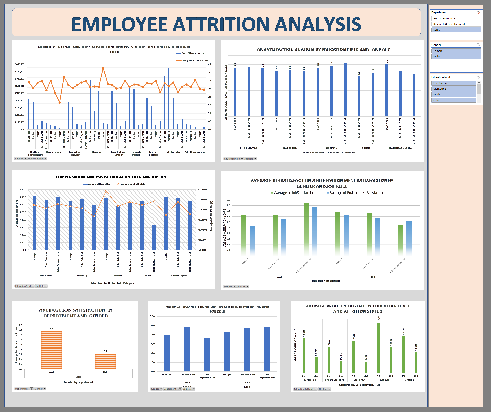

# HR Employee Attrition Analytics

A comprehensive data analytics project focused on understanding employee attrition patterns and predicting workforce turnover using advanced Excel techniques including pivot tables, regression analysis, and interactive dashboards.

## 🎯 Project Overview

This project analyzes employee attrition data to identify key factors contributing to workforce turnover and provides actionable insights for HR decision-making. The analysis employs multiple statistical and visualization techniques to create a comprehensive view of employee retention patterns.

### 🔍 Key Objectives
- **Identify Attrition Drivers**: Analyze factors leading to employee turnover
- **Predict Turnover Risk**: Develop models to forecast attrition likelihood  
- **Create Actionable Insights**: Provide data-driven recommendations for HR strategy
- **Build Interactive Dashboard**: Design user-friendly visualization tools

## 📊 Dataset Information

**Source**: HR Employee Attrition Dataset  
**Records**: 1,470 employee records  
**Features**: 35+ variables including demographics, job characteristics, and satisfaction metrics

### Key Variables Analyzed:
- **Demographics**: Age, Gender, Marital Status, Distance from Home
- **Job Characteristics**: Department, Role, Salary, Years at Company
- **Satisfaction Metrics**: Job Satisfaction, Work-Life Balance, Environment Satisfaction
- **Performance Indicators**: Performance Rating, Training Hours, Promotions

## 🛠️ Methodology & Tools

### Technology Stack
- **Primary Tool**: Microsoft Excel 2019/365
- **Techniques Used**:
  - Pivot Tables & Charts
  - Statistical Analysis & Regression
  - What-If Scenario Modeling
  - Interactive Dashboard Development
  - Data Cleaning & Transformation

### Analysis Framework
1. **Data Preprocessing**: Cleaning and validation of raw dataset
2. **Exploratory Analysis**: Multi-dimensional pivot table analysis  
3. **Statistical Modeling**: Regression analysis for attrition prediction
4. **Scenario Planning**: What-if analysis for different retention strategies
5. **Visualization**: Interactive dashboard creation
6. **Insights Generation**: Actionable recommendations development

## 📈 Key Findings

### Attrition Insights
- **Overall Attrition Rate**: 16.12%
- **High-Risk Departments**: Sales (20.6%), HR (19.0%)
- **Critical Age Group**: 25-35 years show highest turnover
- **Salary Impact**: Employees earning <$50K have 24% attrition rate

### Predictive Factors
- Job satisfaction scores below 3.0 increase attrition risk by 40%
- Employees with commute >15 miles are 2.3x more likely to leave
- Work-life balance rating strongly correlates with retention

## 📁 Repository Structure
